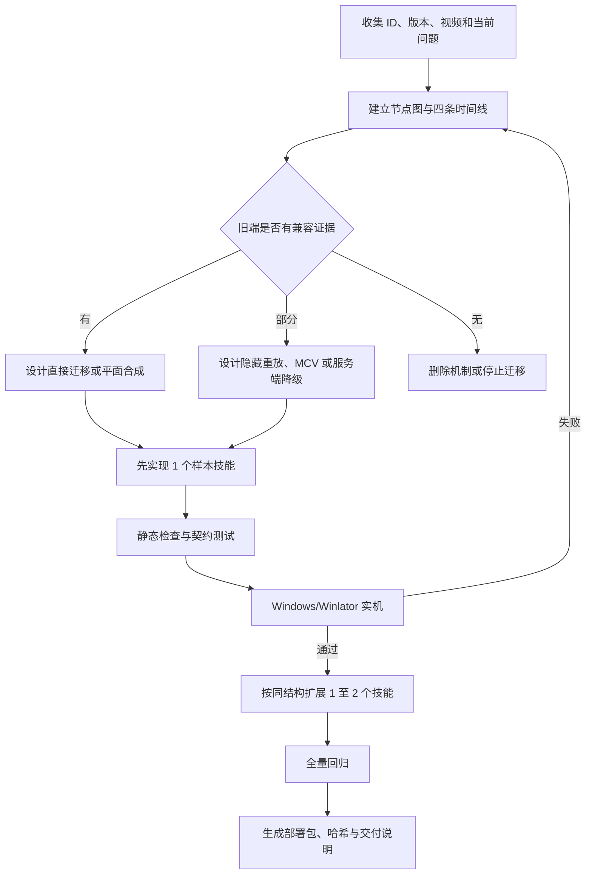

# 旧端技能迁移修改流程

本文根据冰雷五、六转技能迁移与多轮实机修复整理，适用于把 TMS/KMS 等高版本技能降级到
BeiDou 旧客户端。目标不是机械复制全部现代机制，而是在旧端支持边界内完成稳定、可解释、可回退的
视觉与伤害闭环。

所有阶段遵守一个原则：资源能读取，不代表节点能被旧客户端解释；动画能播放，也不代表伤害时间线正确。

## 1. 分析

### 1.1 固定输入

开始前记录以下内容，缺一项就不进入实现：

- 源区服、源版本、源技能 ID、所有隐藏或派生 ID。
- 目标职业、目标 ID 范围、旧客户端版本和服务端版本。
- 参考视频、截图、技能说明，以及用户实际关注的视觉片段。
- 当前客户端、服务端、DLL、脚本和阶段文档的修改状态。
- 已知实机问题，例如少特效、只打一只怪、怪物死亡过早、动画结束后仍有伤害。

同一个 ID 必须同时检查 Skill 与 String。冰雷 `2201009`、`400021002` 都出现过跨版本复用，仅凭 ID
或当前显示名判断资源归属会得出错误结论。

### 1.2 节点清单

为每个主技能建立完整节点图，而不是只看入口节点：

- 主技能：`action`、`effect`、`effect0`、`ball`、`hit`、`mob`、`summon`、`screen/video`。
- 隐藏阶段：`skillList`、后续攻击、被动终结、领域 tick、召唤攻击、追踪对象。
- 间接引用：UOL、`outlink`、跨 IMG 链接、共享 Effect、基础动作和音效索引。
- 现代机制：`SecondAtom`、`footholdAffectedArea`、Particle、Spine、Shader、相机和追踪字段。
- 参数：伤害、段数、目标数、范围、MP、冷却、概率、状态、持续时间和延迟。

节点清单至少输出下表：

| 项目 | 源节点 | 旧端证据 | 决策 |
| --- | --- | --- | --- |
| 人物动作 | `action/effect` | 同职业旧技能可播放 | 直接迁移或平面合成 |
| 怪物命中 | `hit/mob/affected` | 旧端同结构可播放 | 保留并绑定实际怪物 |
| 大画面 | `screen/video` | WZ 大 Canvas 风险高 | 转透明 MCV |
| 持续对象 | `summon/tile/SecondAtom` | 无现代对象运行时 | 服务端时间轴降级 |
| 状态效果 | `time/prop` | 服务端有对应状态分支 | 单独验证单位和概率 |

### 1.3 四条时间线

每个技能必须分别计算四条时间线，禁止用一个 `time` 字段代替全部语义：

1. 施法时间线：人物动作与角色侧 effect 的帧 delay。
2. 视觉时间线：hit、领域、召唤、MCV 的开始、循环和结束时间。
3. 伤害时间线：主击、隐藏重放、周期 tick 和终结攻击的结算时间。
4. 状态时间线：冻结、眩晕、无敌、减速等状态的实际持续时间。

放行条件：最后一次伤害必须落在可见攻击效果结束前；若伤害要继续，画面中必须仍有明确的持续对象。
殛冻领域的 MCV 在 5520ms 结束，而旧方案伤害持续到 30000ms，属于必须阻断的时间线错误。

### 1.4 可行性分级

- 高：动作、effect、hit 和参数可沿用旧端已验证结构。
- 中高：主体视觉可还原，现代追踪或领域对象可改为固定位置、首个目标或定时扫描。
- 中：只能保留起手与命中特效，机制需要明显简化。
- 低：依赖未知客户端对象、无法安全表达，或会触发“不正确的游戏数据”。
- 不迁移：视觉无法形成闭环，或降级后与参考技能已经不是同一表现。

分析阶段的产物是逐技能可行性表、节点图、四条时间线和未决风险，不能直接产出修改文件。

## 2. 方案

### 2.1 选择顺序

按照下面顺序选择最低风险方案：

1. 复用同职业旧技能的动作、攻击分类和节点形状。
2. 将多个旧端可解码层按时间和 z 顺序合成为普通 Canvas。
3. 用隐藏技能节点承载后续 hit，由服务端按固定时间重放。
4. 将大范围 `screen/video` 转成 VP9 色彩轨加 Alpha 轨的透明 MCV。
5. 将现代对象降级为固定施法点、实际怪物位置或定时范围扫描。
6. 无法稳定表达的机制明确删除，不写入似是而非的现代节点。

### 2.2 单技能方案卡

每个技能在修改前先写一张方案卡：

- 显示技能 ID、隐藏技能 ID、源 ID 和显示名称。
- 客户端入口、人物动作、必播 effect、怪物 hit 和 MCV 文件。
- 服务端主击、后续攻击、选怪范围和精确毫秒时间点。
- 目标数、段数、伤害、MP、冷却和状态效果。
- 不复刻内容及其替代表现。
- 最小成功标准和明确失败标准。

例如冰河纪元最终方案不是伪造地面冰层，而是 2040ms 施法 MCV 加实际怪物位置的随机冻结 hit。
冻结 hit 先播放，1000ms 后才对同一批存活怪物扣血，避免怪物被秒杀后看不到冻结过程。

### 2.3 视觉与机制取舍

出现冲突时按以下优先级取舍：

1. 客户端稳定，不出现错误数据或崩溃。
2. 关键视觉完整，包括人物动作、主体特效、命中特效和结束动作。
3. 视觉与伤害同步，不能空打、重复打或画面结束后继续打。
4. 目标数、范围、冷却和伤害结构合理。
5. 最后才考虑追踪、概率、充能、地图 foothold 和其他现代细节。

## 3. 约束

### 3.1 客户端硬约束

- 共享 IMG 只做增量增删或等长原位修改，禁止整文件重编码。
- 修改前后记录原有技能节点哈希、文件尺寸、尾区容量和可见节点数。
- 新增 Canvas 统一为旧端已验证的 ARGB4444，逐张解码并确认 Alpha 非空。
- 局部、跟随人物或怪物的效果保留为 Skill Canvas，不能改成固定屏幕 MCV。
- 大型全屏演出优先使用透明 MCV，避免把数十 MB Canvas 塞入共享 IMG。
- MCV 必须是色彩/Alpha 双轨，尺寸、帧数、delay 数量完全一致。
- 不写入没有旧端证据的现代节点；未知字段默认删除或降级，而不是试错下放。
- UOL/outlink 必须解析到最终资源再判断，禁止把链接名称当成机制证据。

### 3.2 技能 ID 约束

- 可见主技能写字符串、进入授予数组和攻击分类白名单。
- 隐藏节点设置 `invisible=1`，不写字符串、不授予玩家、不进入 AoE 主技能白名单。
- 主技能与全部伤害阶段必须成组迁移或成组删除，不能留下半套客户端或服务端节点。
- ID 白名单逐项登记，禁止为了省事放行连续 ID 范围。

### 3.3 服务端约束

- `mobCount/lt/rb` 不等于旧客户端已经支持多目标，必须同时检查攻击分类路径。
- `time` 的秒、毫秒和次数语义必须从服务端解析代码确认，防止二次乘除。
- 延迟攻击必须绑定施法地图和角色存活状态，换图、死亡或离线后停止。
- 需要“先视觉后伤害”时，先捕获目标并发送视觉包，再延迟对同一批仍存活目标结算。
- 周期扫描只有在视觉仍持续时才能继续；动画结束后不得残留不可见伤害。
- 服务器生成的 hit 必须落在真实怪物位置，禁止用固定屏幕坐标伪造怪物命中特效。

### 3.4 工作区约束

- 保留用户已有修改，不回滚、不格式化无关文件、不清理无关生成物。
- 手工文本修改使用增量补丁；二进制只由已有迁移器或导出器生成。
- 生成脚本必须可重复执行，相同输入得到相同结构和可解释的哈希变化。
- 只有运行时 Java、DLL 或视频映射发生变化时才更新对应部署产物。

### 3.5 典型风险

| 现象 | 常见原因 | 预防措施 |
| --- | --- | --- |
| 不正确的游戏数据 | 下放未知节点、链接失效、结构超出旧端解析范围 | 只保留旧端实证结构 |
| 特效过于简单 | 只迁主节点，漏隐藏 effect/hit | 先完成节点图 |
| 雷柱或领域不显示 | 隐藏攻击包只稳定播放 hit | 将必播视觉合入主 effect/hit |
| 只攻击一只怪 | 高 ID 未进入旧魔法 AoE 分类 | 精确白名单加契约测试 |
| 怪死后看不到 hit | 视觉和致死伤害同一时刻 | 先视觉，延迟扣血 |
| 动画结束仍掉血 | 服务端持续时间照搬现代机制 | 对齐 MCV/Canvas 结束时间 |
| IMG 体积暴涨 | 全屏帧写入共享 Skill IMG | 改用透明 MCV |
| 固定冰面很丑 | 屏幕坐标无法适配地图 foothold | 改用怪物锚定 hit 或删除 |

## 4. 实现

### 4.1 修改边界

按责任分层修改，避免一个脚本同时承担所有工作：

- 客户端 Skill：动作、Canvas、hit、隐藏节点和旧端元数据。
- 客户端 String：仅可见技能名称和说明。
- Map/Effect：只保存经过验证的小型视频标记，不保存大帧主体。
- Video：MCV 成品及其可重复导出脚本。
- 服务端 WZ/XML：等级参数、范围、冷却和隐藏节点。
- Java：技能常量、授予数组、选怪分类、伤害与状态时间线。
- DLL：高 ID 分发、攻击类型和 MCV 映射。
- 测试与文档：记录每个跨层契约和已接受的降级。

### 4.2 推荐实现顺序

1. 记录基线哈希、尺寸、节点数和原技能记录。
2. 先迁一个最简单、最容易实机辨认的技能作为样本。
3. 补齐隐藏节点，但保持不可见、不可授予。
4. 转换局部资源，逐帧保留 delay、origin、z 和左右朝向。
5. 大画面单独导出 MCV，验证 Alpha 后再接视频标记。
6. 接入精确攻击类型和目标数白名单。
7. 根据视觉时间线实现服务端伤害与状态时间线。
8. 写可见字符串与授予数组，检查删除技能不会残留键位。
9. 第二轮才允许一次迁两个同结构技能；任何新坑先回写流程和测试。

### 4.3 时间线实现规则

服务端时间点使用显式毫秒数组或可审计的等差序列。每个数组都要回答三个问题：

- 这个时刻屏幕上正在播放什么？
- 目标是首次捕获、重新扫描，还是跟随施法者？
- 怪物在此之前死亡、进入范围或离开范围时如何处理？

“先冻结、后攻击”的通用模式如下：

```text
preview(t): 选择并保存实际怪物 ID -> 发送零结算视觉攻击包
damage(t + 1000ms): 仅对保存列表中仍存活、仍在原地图的怪物扣血
next preview: 必须晚于上一轮 damage，避免冻结预演与上一轮秒杀重叠
```

除非画面仍有持续领域，否则必须满足：

```text
最后伤害时刻 <= 最后可见攻击帧结束时刻
```

### 4.4 生成与部署产物

- 修改源脚本后重新生成目标 IMG/MCV，禁止手工编辑生成二进制内容。
- Java 只改调度表时，可用 JDK 21 增量编译并替换 JAR 中对应 class；结构或依赖变化时再完整打包。
- DLL 只有攻击分类、技能分发或视频映射变化时才重新构建。
- 每个生成步骤都记录输入资源、输出尺寸、帧数、时长和 SHA256。

## 5. 流程



阶段门槛如下：

| 阶段 | 必须产物 | 放行条件 |
| --- | --- | --- |
| G0 基线 | 哈希、尺寸、节点数 | 可证明未触碰原记录 |
| G1 分析 | 节点图、时间线、风险表 | 所有隐藏阶段已分类 |
| G2 方案 | 单技能方案卡 | 降级内容得到明确记录 |
| G3 样本 | 一个完整技能闭环 | 数据可读、服务端可结算 |
| G4 静态 | Canvas/MCV/契约结果 | 全部自动检查通过 |
| G5 实机 | 视频和问题清单 | 视觉、目标数、时长通过 |
| G6 扩展 | 同结构技能批次 | 不引入新兼容节点 |
| G7 回归 | 完整回归记录 | 无旧技能和跨职业回归 |
| G8 交付 | 目录副本、哈希、说明 | 下载副本与工作区一致 |

实机失败必须回到分析阶段重新解释原因，不能只在画面上继续叠资源。寒冰步冰层方案失败后撤回为
怪物锚定 hit，就是这一规则的直接结果。

## 6. 回归

### 6.1 数据与资源

- [ ] 原有技能记录哈希、文件尺寸和可见节点数符合预期。
- [ ] 新增主节点和隐藏节点数量与方案一致。
- [ ] 所有隐藏节点不可见、无字符串、不可授予。
- [ ] 所有 Canvas 可解码、Alpha 非空、格式为 ARGB4444。
- [ ] UOL/outlink 可解析，不存在悬空链接。
- [ ] 未出现未分类现代节点。
- [ ] MCV 色彩/Alpha 轨帧数一致，delay 总和等于设计时长。
- [ ] MCV 首帧、关键帧、尾帧均非异常黑屏或定格残留。

### 6.2 客户端实机

- [ ] 技能可学习、可绑定、可连续施放，删除技能不会残留键位。
- [ ] 人物动作、effect、ball、hit、结束动作帧序完整。
- [ ] 左右朝向、origin、z 层级和镜头移动表现正确。
- [ ] 单怪、多怪、普通怪、Boss 的目标数符合方案。
- [ ] 怪物命中特效绑定实际怪物，不在固定屏幕位置空放。
- [ ] 致死攻击前有足够时间播放要求的冻结或命中特效。
- [ ] 其他玩家视角不会重复播放或缺失关键效果。
- [ ] MCV 不遮挡 UI、伤害数字或其他玩家，结束后场景正常恢复。
- [ ] Windows 与 Winlator 均不出现错误数据、崩溃或持续黑屏。

### 6.3 服务端行为

- [ ] MP、冷却、伤害、段数、目标数和范围正确。
- [ ] 主击不会与 0ms 隐藏重放重复结算。
- [ ] 周期攻击按方案重新扫描或固定目标，不混用两种语义。
- [ ] 视觉预演与伤害结算严格相差设计延迟，并使用同一批目标。
- [ ] 怪物死亡、角色死亡、换图和离线后，延迟任务安全退出。
- [ ] 最后一次伤害不晚于持续视觉结束时间。
- [ ] 隐藏技能不触发冷却、不消耗 MP、不进入玩家技能列表。
- [ ] 原职业四转技能和其他职业迁移技能行为不变。

### 6.4 自动验证

至少执行与改动范围对应的检查：

```bash
rtk python3 -m py_compile <修改过的 Python 脚本>
rtk python3 <定向契约测试> <相关测试方法>
rtk env JAVA_HOME=<JDK21> mvn -q -DskipTests compile
rtk unzip -tq <部署 JAR>
rtk shasum -a 256 <工作区文件> <下载副本>
```

涉及 MCV 时额外解析头部并检查：编码、宽高、颜色帧数、Alpha 帧数、delay 数量和总时长。涉及 DLL 时
必须做对应架构构建和技能 ID 映射检查。自动验证通过不替代实机验收。

### 6.5 回归退出标准

只有同时满足以下条件才算完成：

- 静态契约、资源解码和编译检查通过。
- 参考视频中的关键视觉已经出现，或降级差异已明确接受。
- 伤害目标、节奏和结束时间与画面一致。
- 不出现“不正确的游戏数据”、崩溃、黑屏和跨技能污染。
- 下载交付副本与工作区成品哈希一致。

## 7. 交付

### 7.1 目录镜像

交付目录保持仓库相对路径，禁止把同名文件平铺在一起。至少按实际改动复制：

```text
clien/Data/Skill/
clien/Data/String/
clien/Data/Map/
clien/Data/Video/
gms-server/wz/
gms-server/src/
gms-server/BeiDou.jar
tool/client-video/
tool/scripts/patch-skill/
docs/patches/
source-cache/
```

`source-cache` 只交付生成器仍然依赖的源包。已经撤销且脚本不再引用的实验资源可以保留作审计，但必须
标明“非运行依赖”，不能让部署者误以为需要放入客户端。

### 7.2 交付清单

- [ ] 客户端 IMG、字符串、Effect 和 MCV 已按目录复制。
- [ ] 服务端 XML、Java 源码和可运行 JAR 已同步。
- [ ] DLL 仅在本轮确有变化时替换。
- [ ] 迁移器、导出器、测试和阶段文档已同步。
- [ ] 每个工作区文件与下载副本 SHA256 一致。
- [ ] JAR/ZIP 完整性检查无错误。
- [ ] 交付说明列出需要重启的客户端或服务端组件。
- [ ] 明确记录未复刻机制和实机重点检查项。

### 7.3 交付说明模板

```text
技能与版本：
本轮修改：
明确删除或降级：
视觉时间线：
伤害时间线：
客户端文件：
服务端文件：
需要重启：
自动验证：
实机重点：
成品 SHA256：
回退方式：
```

### 7.4 回退

回退必须与迁移同样可审计：优先使用专用退役脚本剪除目标顶层节点、隐藏字符串和视频标记；不要用旧
整包覆盖当前工作区，也不要回滚无关用户修改。回退后重新检查主动技能数组、键位、服务端常量、视频
映射和原技能哈希，确认客户端与服务端同时退出。

冰雷的逐技能证据、最终参数和具体时间线保存在
`docs/patches/ice-lightning-v-vi-feasibility.md`，本文只定义后续迁移应重复执行的工程流程。
